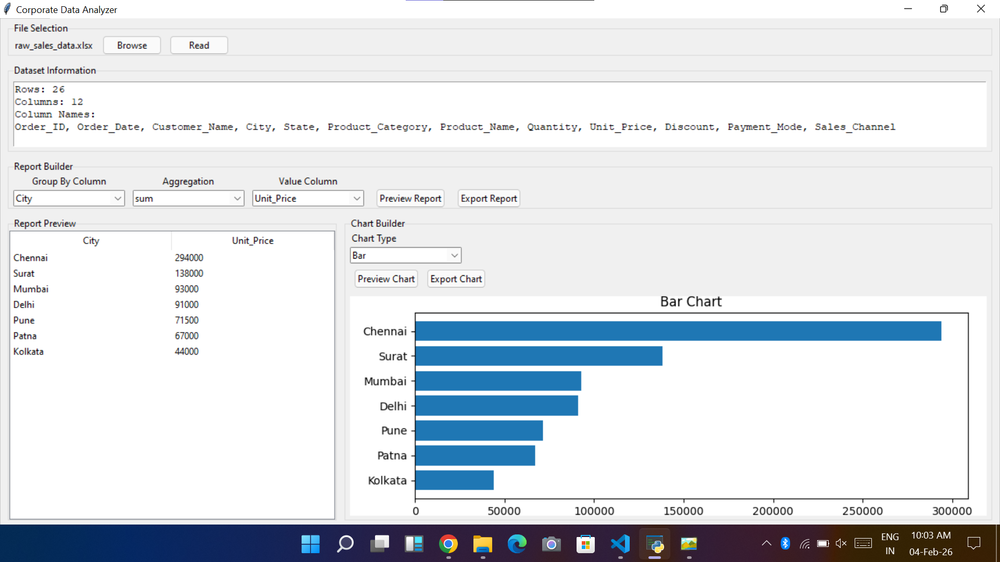
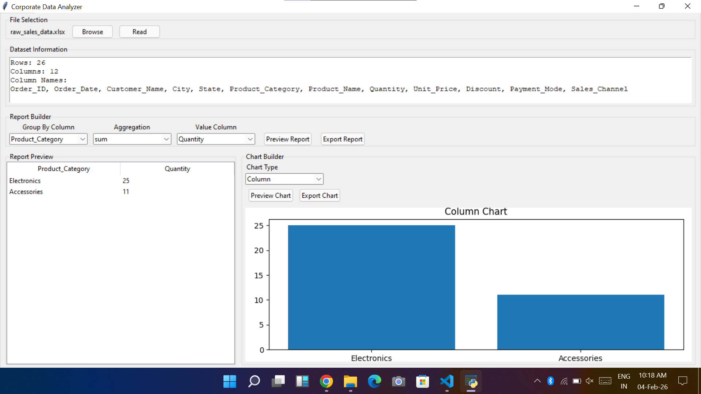
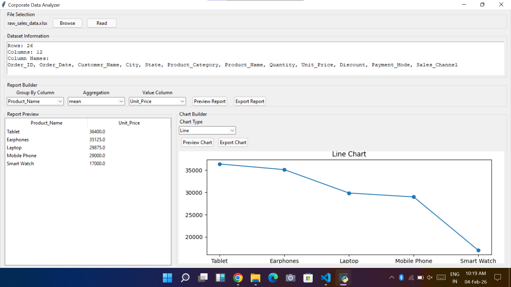
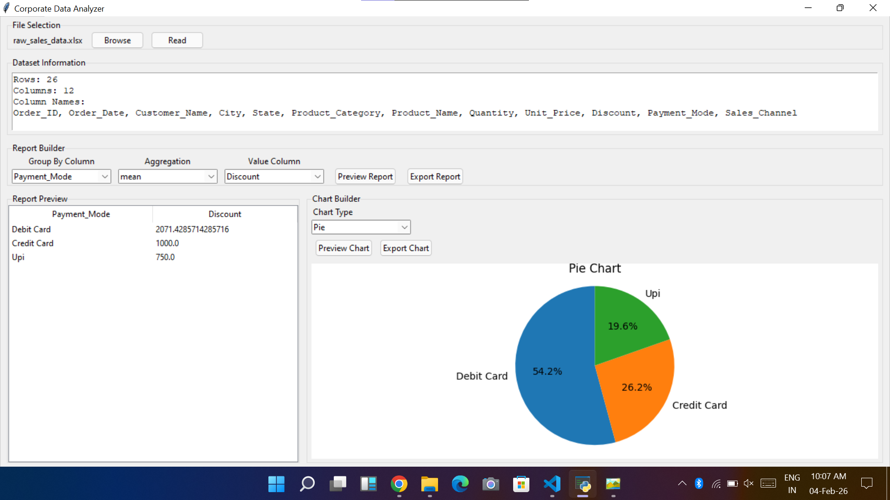

# 📊 Corporate Data Analysis & Reporting Tool using Python

**Tools Used:** Python, Pandas, Matplotlib, Tkinter  
**Dataset:** Sample Business Sales Data (Excel / CSV)  
**Project Type:** Desktop Data Analysis & Reporting Application

---

## 🔍 Project Overview

This project is a Python-based desktop data analysis and reporting tool designed to simplify basic analytical workflows for structured CSV and Excel datasets.

The application allows users to load a dataset, inspect its structure, generate grouped analytical summaries, visualize the results, and export reports and charts through a Tkinter-based graphical interface.

The project focuses on practical use of Pandas for data analysis and aggregation, Matplotlib for visualization, and Tkinter for building an interactive desktop workflow.

---

## 🧠 Key Features

### 🔹 Data Ingestion

- Supports CSV input files
- Supports Excel `.xlsx` and `.xls` files
- Displays:
  - Total number of rows
  - Total number of columns
  - Dataset column names

### 🔹 Basic Data Preparation

- Detects text/object columns
- Standardizes text values by:
  - Removing leading and trailing whitespace
  - Applying consistent title-case formatting

> **Note:** The current version performs basic text standardization. It does not perform comprehensive missing-value handling, duplicate removal, or generic numeric type conversion.

### 🔹 Analytical Reporting

Users can select:

- A text column for grouping
- A numeric value column
- An aggregation method

Supported aggregation methods:

- Sum
- Mean
- Count
- Min
- Max
- Median

The application uses Pandas `groupby()` and aggregation logic to generate analytical summaries and sorts the results in descending order.

### 🔹 Report Preview

- Displays generated reports directly inside the application
- Uses a Tkinter `Treeview` for tabular report preview

### 🔹 Report Export

- Exports generated reports to Excel `.xlsx`
- Saves the exported report using the source file name as the base name

### 🔹 Data Visualization

Matplotlib is used to generate:

- Bar Chart
- Column Chart
- Line Chart
- Pie Chart

Example outputs:









Charts are displayed directly inside the Tkinter application and can also be exported as PNG images.

---

## 🖥️ Application Workflow

```text
Select CSV / Excel File
        ↓
Read Dataset
        ↓
Basic Text Standardization
        ↓
Display Dataset Information
        ↓
Select Grouping Column
        ↓
Select Aggregation Method
        ↓
Select Value Column
        ↓
Generate Analytical Report
        ↓
Preview Report
        ↓
Generate Visualization
        ↓
Export Report / Chart
```

---

## 🛠️ Technologies Used

| Technology | Purpose |
|---|---|
| Python | Core application development |
| Pandas | Data loading, preparation, grouping, aggregation, sorting, and reporting |
| Tkinter | Desktop graphical interface |
| Matplotlib | Data visualization |
| FigureCanvasTkAgg | Embedding Matplotlib charts inside Tkinter |
| Excel / CSV | Input data formats |
| VS Code | Development environment |
| Git & GitHub | Version control and portfolio management |

---

## 🤖 AI-Assisted Development

This project was completed using an AI-assisted development workflow.

AI tools were used to help translate functional requirements into implementation ideas and support iterative development.

The final application was manually run and tested across different:

- Input files
- Grouping selections
- Aggregation methods
- Report outputs
- Chart types

The project helped strengthen my ability to evaluate AI-generated code, debug implementation issues, test functionality, and understand the final workflow rather than relying on generated output without validation.

---

## ⚠️ Current Limitations

The current version:

- Does not perform configurable missing-value handling
- Does not remove duplicates automatically
- Does not perform generic string-to-numeric conversion
- Does not provide arbitrary row-level filtering
- Uses a predefined set of supported numeric value columns:
  - `Quantity`
  - `Unit_Price`
  - `Discount`
- Exports reports to Excel only
- Has not been packaged as a standalone `.exe`

These are potential areas for future development.

---

## 🚀 Future Improvements

Potential enhancements include:

- Dynamic numeric-column detection
- Configurable missing-value handling
- Duplicate detection
- User-defined filtering
- CSV report export
- Additional chart formatting controls
- SQL database connectivity
- Improved text-cleaning rules
- Standalone executable packaging

---

## 🎯 What I Learned

This project helped me strengthen my understanding of:

- Python-based data analysis
- Pandas DataFrames
- GroupBy and aggregation logic
- Data transformation
- Report-generation workflows
- Desktop GUI development with Tkinter
- Data visualization using Matplotlib
- File handling for CSV and Excel data
- Error handling
- AI-assisted development
- Testing and iterative debugging

---

## 📂 Project Files

Typical project files include:

```text
corporate-data-analyzer/
│
├── data/
│   ├── raw_sales_data.xlsx
├── src/
│   ├── corporate_data_analyzer.py
├── README.md
├── requirements.txt
│
└── outputs/
    ├── bar_chart.png
    ├── column_chart.png
    ├── line_chart.png
    └── pie_chart.png
```

Update this section if the actual GitHub repository structure differs.

---

## ▶️ Running the Application

### 1. Clone the repository

```bash
git clone <your-repository-url>
```

### 2. Navigate into the project

```bash
cd corporate-data-analyzer
```

### 3. Install the required dependencies

```bash
pip install pandas matplotlib openpyxl
```

### 4. Run the application

```bash
python corporate_data_analyzer.py
```

---

## 👤 Author

### Aditya Patne

- LinkedIn: https://linkedin.com/in/adityapatne001
- GitHub: https://github.com/adityapatne001
